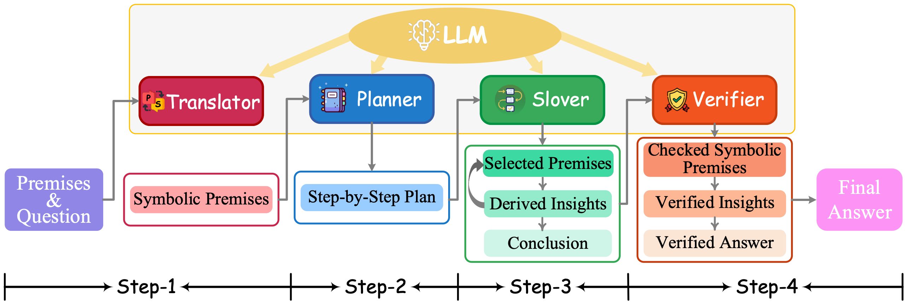

# SymbCoT

Codes and Data for ACL 2024 Paper ["Faithful Logical Reasoning via Symbolic Chain-of-Thought"](https://arxiv.org/abs/2405.18357#:~:text=While%20the%20recent%20Chain%2Dof,expressions%20and%20rigid%20deducing%20rules.)

Authors: [**Jundong Xu**](https://aiden0526.github.io/JundongXu/)<sup>1</sup>, [**Hao Fei**](http://haofei.vip/)<sup>1</sup><sup>*</sup> (Corresponding author), [**Liangming Pan**](http://www.liangmingpan.com/)<sup>2</sup>, [**Qian Liu**](https://profiles.auckland.ac.nz/liu-qian)<sup>3</sup>, [**Mong-Li Lee**](https://www.comp.nus.edu.sg/cs/people/leeml/)<sup>1</sup>, [**Wynne Hsu**](https://www.comp.nus.edu.sg/cs/people/whsu/)<sup>1</sup>

<sup>1</sup> National University of Singapore, Singapore, <sup>2</sup> University of California, Santa Barbara, USA, <sup>3</sup> University of Auckland, New Zealand

**Introduction**
-----
While the recent Chain-of-Thought (CoT) technique enhances the reasoning ability of large language models (LLMs) with the theory of mind, it might still struggle in handling logical reasoning that relies much on symbolic expressions and rigid deducing rules.
To strengthen the logical reasoning capability of LLMs, we propose a novel Symbolic Chain-of-Thought, namely **SymbCoT**, a fully LLM-based framework that integrates symbolic expressions and logic rules with CoT prompting. 
Technically, building upon an LLM, SymbCoT 1) first translates the natural language context into the symbolic format, and then 2) derives a step-by-step plan to solve the problem with symbolic logical rules, 3) followed by a verifier to check the translation and reasoning chain.
Via thorough evaluations on 5 standard datasets with both First-Order Logic and Constraint Optimization symbolic expressions, SymbCoT shows striking improvements over the CoT method consistently.



**Dataset**
-----
We test our framework on 5 different datasets using 2 symbolic formats.

First-order Logic: [ProntoQA](https://github.com/asaparov/prontoqa), [ProofWriter](https://allenai.org/data/proofwriter), [FOLIO](https://github.com/Yale-LILY/FOLIO)

Constraint Optimization: [LogicalDeduction](https://github.com/google/BIG-bench/tree/main/bigbench/benchmark_tasks/logical_deduction), [AR-LSAT](https://github.com/zhongwanjun/AR-LSAT)

**Setup**
-----
Please install all the required packages first by running the following command:
```
pip install -r requirements.txt
```

**Logical Inference**
-----
To use the logical inference, please run the following command:
```
python symbcot.py \
    --api_key "Your API Key" \
    --model_name "Model Name [gpt-3.5-turbo | gpt-4]" \
    --data_path "The Path of Your Data" \
    --dataset_name "Dataset [ProntoQA | ProofWriter | FOLIO | LogicalDeduction | AR-LSAT]" \
    --split dev
```
The results will be saved in the ```./results```.

**Verification**
-----
To verify the logical inference, please run the following command:
```
python verifier.py \
    --api_key "Your API Key" \
    --model_name "Model Name [gpt-3.5-turbo | gpt-4]" \
    --data_path "The Path of Your Data" \
    --dataset_name "Dataset [ProntoQA | ProofWriter | FOLIO | LogicalDeduction | AR-LSAT]" \
    --split dev
```
The verified results will be saved in the ```./verified_results``` with a suffix ```verified```.

**Evaluation**
-----
To evaluate the results, please run the following command:
```
python evaluate.py \
   --dataset_name "Dataset [ProntoQA | ProofWriter | FOLIO | LogicalDeduction | AR-LSAT]" \
   --model_name "Model Name [gpt-3.5-turbo | gpt-4]" \
   --split dev \
   --verification "Verified or Not [True | False]"
```

**Citation**
-----
Please cite the paper if you use this framework during your research.
```
@inproceedings{
    author={Jundong Xu and Hao Fei and Liangming Pan and Qian Liu and Mong-Li Lee and Wynne Hsu},
    title={Faithful Logical Reasoning via Symbolic Chain-of-Thought},
    booktitle={The 62nd Annual Meeting of the Association for Computational Linguistics},
    year={2024},
    url={https://arxiv.org/abs/2405.18357}
}
```

